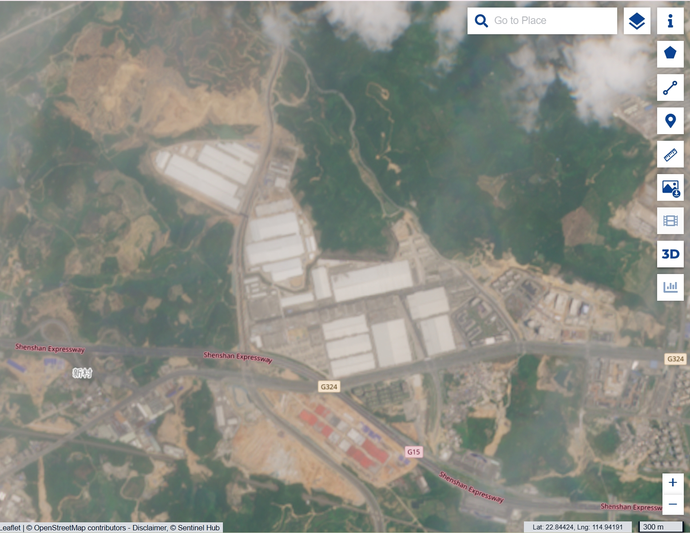

+++
date = '2025-06-04T18:11:21.388Z'
title = '卫星图中BYD的扩张'
+++

朋友圈看到入职比亚迪的同学连着几天发了一些宣传材料，联想到近日比亚迪面对被与恒大对比的争议。有说法指比亚迪拉长供应商账期的做法事实上是以应付账款增加资本支出，存在期限错配的风险，一旦销售收入波动有可能出现现金流紧张；也有说法指比亚迪通过拖延库存确认隐藏表外负债、实际负债高于报表所示。后者是更严重的指控，然而不参与到比亚迪的供应链中很难确认其真实性。不论如何，比亚迪在几年间的扩张速度有目共睹，而资本支出必然也伴随负债的增加。另一方面，这是比亚迪或者说中国新能源汽车企业超高执行力的体现。宝马公司2025年一季度报显示盈利下降26%，同时新闻稿中特别提及在激烈竞争的中国市场营收下降，从侧面说明了这些企业对传统车企的冲击。

> Gegenüber dem Vorjahr zeigten sich wie erwartet rückläufige Umsatzerlöse im wettbewerbsintensiven chinesischen Markt. (BMV)

好奇收集了一些比亚迪厂区的卫星影像记录了这惊人的扩张速度。

## 合肥长丰

📍 32°10'0.11"N, 117°14'25.74"E

据长丰县刊登于2025年03月12日人民日报的广告，“2021年7月，比亚迪合肥基地落户长丰县下塘镇。项目从谈判到签约23天，从签约到开工42天，从开工建设到整车下线10个月，产值过百亿元用时5个月、产值过千亿元用时两年半...”。 

### 一期

### 二期

### Sentinel-2 2025年5月状态

2025年5月的影像可见厂区仍在扩张中。“比亚迪集团在合肥投下巨资，分别建设一期、二期、三期整车项目，总投资达400亿元，整车产能规划130万辆以上，成为比亚迪全国最重要的制造基地。”

## 郑州航空港

📍 34°23'47.88"N, 113°56'19.15"E

据多个网站未有明确来源的信息，“郑州比亚迪工厂共划分为三期项目（一期、二期为整车生产项目），其中一期工程用地面积超4104亩，规划产能为40万辆；二期用地3838亩；三期用地2500亩，为新能源动力电池项目”。又据河南日报2025年2月11日，“郑州比亚迪2024年新能源汽车整车产量达到54.5万辆，同比增长169.8%。”。

### 一二期

### Sentinel-2 2025年5月状态

据2025年4月29日徐工集团的公众号文章，“郑州比亚迪超级工厂五期项目全面启动”。6月3日郑州比亚迪汽车有限公司以15282万元的成交价，竞得编号为郑港出〔2025〕51号的地块。该地块位于淮海路以南、竹贤东街以西，使用权面积449489.73平方米。

## 济南

📍 36°52'37.57"N, 117° 5'50.74"E

据济南当地媒体，“济南比亚迪新能源乘用车及核心零部件项目总占地6000余亩，一期占地3623余亩，总投资150亿元，2022年当年建厂、当年整车下线”。同时据央广网济南2025年4月18日文章，“比亚迪济南基地二期工程投产后预计年产能突破30万辆，整体带动就业超3万人”。

### 一二期

### Sentinel-2 2025年6月状态

据当地媒体，“三期项目建成后，比亚迪济南将实现年产50万辆以上”。

## 常州

📍 31°53'54.78"N, 119°50'9.44"E

据常州日报2024年11月22日，“今年以来，比亚迪常州基地持续满产，10月产量超3.3万台，预计全年产量近30万台”。据该报当年1月31日，“比亚迪新能源汽车核心零部件产业园项目（比亚迪常州基地二期）奠基，在一期基础上再投资100亿元”。

### 一期

### 二期

### Sentinel-2 2025年5月状态

可见二期即将完工，同时西侧大片土地被平整，或许将是新一期扩张用地。

## 抚州

📍 27°53'14.09"N, 116°24'26.58"E

据电车汇文章，“12月17日...比亚迪将在抚州高新区投资80亿元建设年产15GWh新能源动力电池项目”。同时，“这是继比亚迪抚州新能源汽车产业园（20万辆）、零部件产业园后，比亚迪再次在抚州投入巨资建设新能源动力电池产业园”。

### 一二期

### Sentinel-2 2025年6月

## 西安

📍 34° 1'35.39"N, 108°42'27.85"E

西安厂区已有超20年历史，发展过程可见发布于腾讯网[文章](https://web.archive.org/web/20250604165841/https://news.qq.com/rain/a/20231114A02R0R00)，“2022年，位于周至县的比亚迪西安三期工厂正式启动总装仪式，三期建设完成后年比亚迪西安基地总产能将达到规划的90万辆”。

## 汕尾

📍 22°50'5.77"N, 114°57'21.55"E

据南方日报2024年7月8日文章，“自2021年以来，深汕成功引进了比亚迪汽车工业园一二期项目，从开工到投产分别只花了349天、379天，用超常规速度推动项目开花结果”。深汕合作区亦有文章描述，“比亚迪一期项目16栋厂房、共174条产线全部满产；比亚迪二期项目西地块13栋厂房全部投产并开启双班生产，整车日产量突破1300辆，全年生产整车超25万辆”。同时有2024年文章，“今年7月8日，深汕比亚迪汽车工业园三期项目正式签约，计划总投资65亿元。该项目占地面积约130万平方米，主要建设电池PACK线（电池组装线）、新能源汽车核心零部件工厂及刀片电池组装”。

### Sentinel-2 2025年5月

因谷歌地球未有近期影像，一二三期的低分辨率影像都从Sentinel-2获得。

最后一图可见施工中的深汕高铁，既厦深铁路和广汕高铁之后珠三角往粤东地区的第三条高速铁路通道。